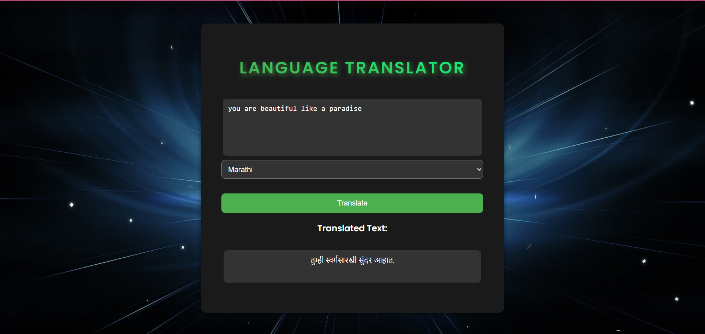

# 🌍 Language Translator using LLM

A web-based multilingual translation application built with the **M2M100 model** from Hugging Face's Transformers library. This project translates text from one language to another using a powerful multilingual LLM (Large Language Model).

## ✨ Features

- 🔤 Translate text between 100+ languages
- 🧠 Powered by Meta’s M2M100 multilingual model
- 🌐 Clean and user-friendly web interface (HTML + CSS)
- 🔁 Backend translation logic in Python using Transformers
- 🔒 Hugging Face API integration with authentication token

## 🚀 Tech Stack

- **Frontend:** HTML, CSS
- **Backend:** Python (Flask or FastAPI)
- **Model:** M2M100 from Hugging Face Transformers
- **API Integration:** Hugging Face Token-based authentication

## 📸 Screenshots




## 🔧 Setup Instructions

### 1. Clone the Repository

```bash
git clone https://github.com/your-username/language-translator-llm.git
cd language-translator-llm
```
 ### 2. Install Dependecies

 ```bash
pip install -r requirements.txt
```

requirements.txt
```nginx
transformers
torch
flask   # or fastapi
requests
```
###3. Set Up Hugging Face Token
Create an account at huggingface.co

Generate a token from your profile settings

Store it securely in your environment or Python script

### 4. Run the App
```bash
python app.py
```
Open your browser and go to http://127.0.0.1:5000/ to view the web app.

🧪 Example
Input: "Hello, how are you?"
From: English
To: Spanish
Output: "Hola, ¿cómo estás?"

### 📁 Project Structure
```sql
language-translator-llm/
├── app.py
├── templates/
│   └── index.html
├── static/
│   └── style.css
├── requirements.txt
└── README.md
```
### 🤖 About the Model

We use facebook/m2m100_418M, a state-of-the-art multilingual model capable of translating directly between any pair of 100+ languages without relying on English as an intermediate.

### 📜 License
This project is licensed under the MIT License.

### 🙌 Acknowledgements
Hugging Face Transformers

Meta AI - M2M100


### 📬 Contact
For feedback or collaboration, feel free to connect:

Pradumna Uddhavrao Kadam
Email: pradumnakadam07@gmail.com
LinkedIn: https://www.linkedin.com/in/pradumna-kadam-883a40293/
GitHub: @pradumnakadam07


